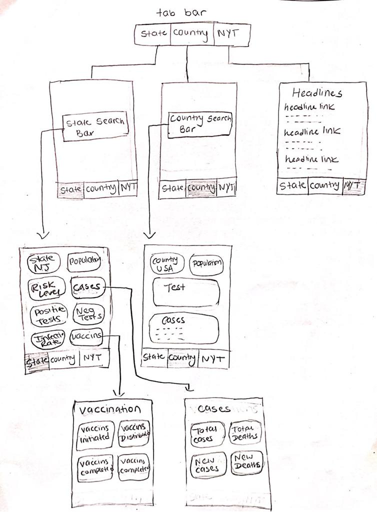

# COVID DASHBOARD

## Table of Contents
1. [Overview](#Overview)
1. [Product Specs](#Product-Spec)
1. [Wireframes](#Wireframes)
2. [Schema](#Schema)

## Overview
### Description
This app shows COVID related information in a simple UI form for users to get any information they need. They can filter it by States for USA and Counties for USA, and Countries across the world. There would also be a tab to stay up-to-date on the latest covid related news headlines from NY Times. The data shown will use three different api's one will be used to get data for the US, and the other will be used to get data for different countries in the world, and the last one will be used to get data for news headlines and links for each headline.

### App Evaluation
- **Category:** Educational/Utility
- **Mobile:** This app is best used on a mobile however, it would work just as well on web as well because, It is basically going to display some data in a beautified way for the ease of use for the users.
- **Story:** The user can access data related to COVID all in one place, also when planning a trip to a certain state or a country they can use the data to make informed decisions with ease as the data for different countries and states in US is updated daily so, the user will have the most recent and accurate data to make their decisions.
- **Market:** Any user can choose to use this app and since there is no social media connection there is no harm in letting anyone use it.
- **Habit:** This app can be used as much as the user prefers to stay connected to COVID related data. It could be used daily to make day-to-day decisions about traveling if the user needs to travel for work.
- **Scope:** The scope of this app is just to receive data about covid and make your own conclusions based on the stats received each day. Something similar to this app can easily be created to show information about something else like weather, or top news stories.

## Product Specs

### 1. User Stories (Required and Optional)

**Required Must-have Stories**

- [x] Users can start the app and see the data for states based on what state they enter in the search bar.
- [ ] Users can switch between different tabs to view data for other countries by searching the countries.
* Click on certain elements of the data to view more details.
   - [x] States
   - [ ] Countries
- [ ] Users can also view the latest headlines from the New York times related to COVID

**Optional Nice-to-have Stories**

- [ ] Ability to use the app offline by downloading the data for the day when you have access to the internet and storing it in a json file and using it to show the data offline.
- [ ] Ability to use the users location data to show them the data in their state without asking them to enter the state each time.

### 2. Screen Archetypes
* Search Bar (States Tab)
  * Search the state user wants to see data on
* State Screen
  * Search Bar for the state the user wants to search
  * Show them the data for their state
  * Certain elements will be clickable and the user will be able to view more information about that element
* Element Screens
  * Cases
    * Show more info on cases
  * Vaccinations
    * Show more info on vaccinations
* Search Bar (Countries Tab)
  * Search the Country user wants to see data on
* Countries
  * Search Bar for the Country the user wants to search
  * Show them the data for their country
* Headlines
  * Show top headlines from NYT in a relative layout

### 3. Navigation

**Tab Navigation** (Tab to Screen)

* States
* Countries
* NYT Covid Headlines and Links

**Flow Navigation** (Screen to Screen)

* Search Bar (States Tab)
   * Leads to a state screen for any state the the user searches
* State Screen
   * Shows the data for the state
   * Element Cases will also be clickable and will lead to another screen that shows all the data on COVID Cases
   * Element Vaccinations will also be clickable and will lead to another screen that shows all data on COVID Vaccinations in the state
* Search Bar (Countries Tab)
  * Countries Screen (Static Page)
    * Shows the data for the country being searched
* Headlines (Static Page in Headlines Tab)
  * Shows Covid related headlines from NYT

## Wireframes

### [BONUS] Digital Wireframes & Mockups

### [BONUS] Interactive Prototype

## Schema 
### Models
| Property      | Type     | Description |
   | ------------- | -------- | ------------|
   | state |  String | name of the sate |
   | riskLevel      | String   | risk level for each state |
   | population        | Number| population of a state |
   | positiveTests         | Number     | number of positive tests |
   | negativeTests       | Number   | number of negative tests |
   | infectionRate | Number   | rating out of 5 for severity of infection rate in that area |
   | vaccinationInitiated    | Number   | number of vaccination initiated |
   | vaccinationDistributed     | Number | number of vaccination distributed |
   | vaccinationCompleted |  Number | number of vaccination completed |
   | vaccinationAdministered |  Number | number of vaccination administered |
   | totalCases |  Number | number of total cases|
   | totalDeaths |  Number | number of total deaths|
   | newCases |  Number | number of new cases|
   | newDeaths |  Number | number of new deaths|
   | country |  String | name of the counrty|
   | populationCountry  | Number| population of a country |
   | tests |  Number | number of tests done in that country|
   | casesCountry |  Number | number of cases |
   | todayCases |  Number | number of cases today |
   | deathsCountry |  Number | number of deaths in that country|
   | todayDeaths |  Number | number of deaths today in that country|
   | recovered |  Number | number of recovered people  |
   | todayRecovered |  Number | number of recovered people today  |
   | web_url |  String | link to the article |
   | description |  String | brief description of the articles|
   | pub_date | DataTime |  date when article is created (default field) |
   | headline |  String | headline of the article |      

### Networking
## [Add list of network requests by screen ]
[Create basic snippets for each Parse network request]
N/A

## [OPTIONAL: List endpoints if using existing API such as Yelp]
##### Covid Act Now Api
Base URL - [https://api.covidactnow.org/v2](https://api.covidactnow.org/v2)

   | HTTP Verb | Endpoint | Description |
   | ----------|----------|------------ |
   | `GET`    | /state/{state}.json?apiKey={apiKey} | get covid data for the {state} |

##### NovelCovid Api
Base URL - [https://corona.lmao.ninja/v2](https://corona.lmao.ninja/v2)

   | HTTP Verb | Endpoint | Description |
   | ----------|----------|------------ |
   | `GET`    | /countries/:query | (:query)=country, get the covid data for that country |

##### Article Search NYT Api
Base URL - [https://api.nytimes.com/svc/search/v2/](https://api.nytimes.com/svc/search/v2/)

   | HTTP Verb | Endpoint | Description |
   | ----------|----------|------------ |
   | `GET`    | /articlesearch.json?q={query}&api-key={apiKey} | get the articles with {query} |

